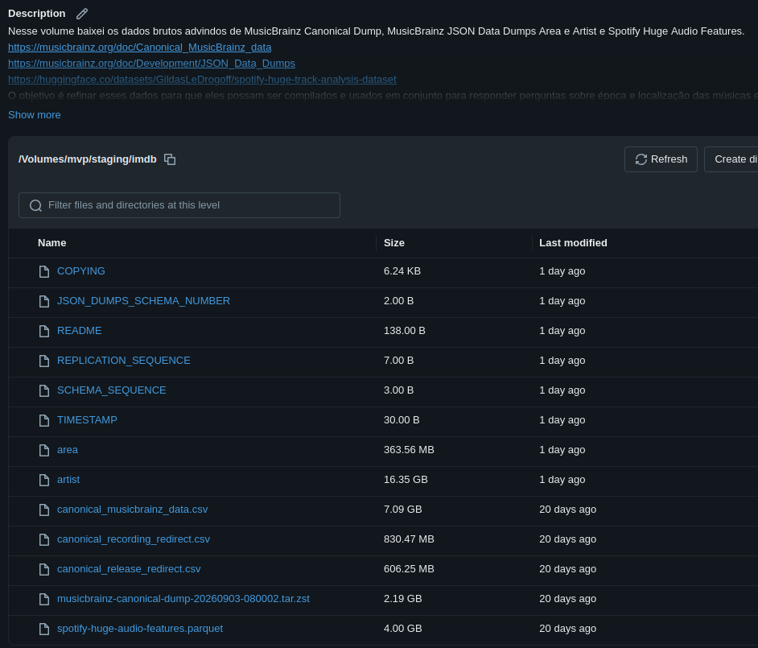
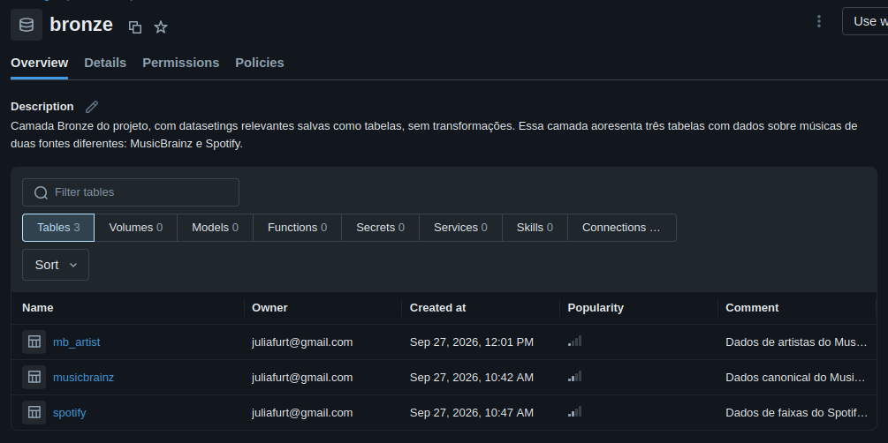
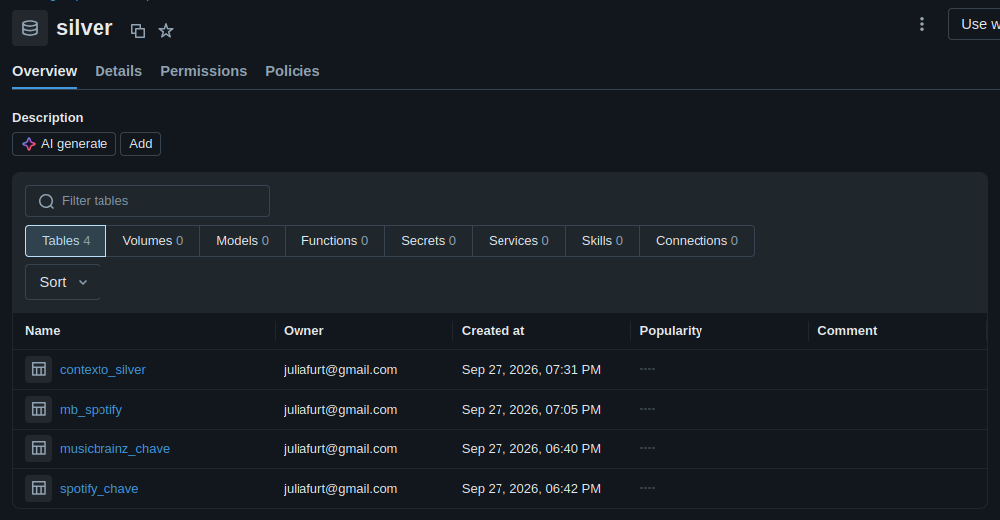
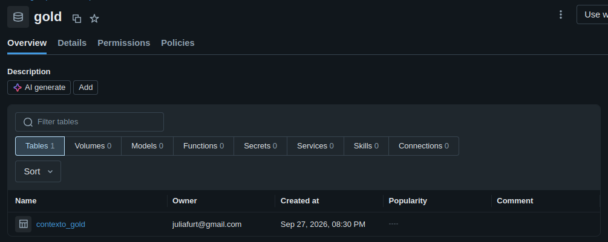

# PUC_Engenharia_Dados
Trabalho para a sprint Engenharia de Dados da pós-graduação em Ciência de Dados da PUC Rio.

# Música em Contexto: MusicBrainz + Spotify
Através desse estudo pretendo explorar os contextos históricos e geográficos das músicas.

## Contexto de Negócios e Perguntas
Perguntas que me motivaram a fazer esse estudo:

- Quais países têm as músicas mais dançantes?
- Quais décadas têm as músicas mais dançantes?
- Quais países tem músicas mais instrumentais?

Para isso vou cruzar informações de três bases de dados:

### MusicBrainz Canonical Dump:
Uma base de dados feita para achar correspondências de artistas e músicas com outras bases de dados

[https://musicbrainz.org/doc/Canonical_MusicBrainz_data](https://musicbrainz.org/doc/Canonical_MusicBrainz_data)

**INFORMAÇÕES DE LICENÇA**

MusicBrainz Canonical Data — MusicBrainz, MetaBrainz Foundation. Licença: Creative Commons Zero (CC0 1.0). Fonte: MusicBrainz Canonical MusicBrainz Data.

### Spotify Huge Audio Features:
Aqui eu encontro as características sonoras das músicas

https://huggingface.co/datasets/GildasLeDrogoff/spotify-huge-track-analysis-dataset

**INFORMAÇÕES DE LICENÇA**

Spotify Huge Track Analysis Dataset, de Gildas Le Drogoff, disponibilizado sob a licença Creative Commons Attribution-NonCommercial 4.0 International (CC BY-NC 4.0).

###JSON Data Dump de MusicBrainz:
Informações de localização dos artistas

 https://musicbrainz.org/doc/Development/JSON_Data_Dumps

INFORMAÇÕES DE LICENÇA

MusicBrainz Artist Data — MusicBrainz, MetaBrainz Foundation. Licença: Creative Commons Zero (CC0 1.0), para os dados core utilizados neste projeto.

## Carga dos Dados

Para esse estudo utilizei três dataframes:

### MusicBrainz Canonical Data
https://musicbrainz.org/doc/Canonical_MusicBrainz_data

| Campo | Informação |
|---|---|
| Fonte | MusicBrainz Canonical Data |
| Autor | MusicBrainz / MetaBrainz Foundation |
| Licença | CC0 1.0 |
| Formato | CSV |
| Finalidade | Correspondência entre dados do Spotify e entidades do MusicBrainz |
| Campos utilizados | `artist_mbids`, `artist_credit_name`, `release_mbid`, `release_name`, `recording_mbid`, `recording_name`, `combined_lookup`, `score` |

### MusicBrainz Artist Data
https://musicbrainz.org/doc/Development/JSON_Data_Dumps

| Campo | Informação |
|---|---|
| Fonte | MusicBrainz Artist Data |
| Autor | MusicBrainz / MetaBrainz Foundation |
| Licença | CC0 1.0 |
| Formato | JSON |
| Finalidade | Associar uma localização a cada artista da base de dados. |
| Campos utilizados | `id`, `name`, `country` |

### Spotify Huge Audio Features
https://huggingface.co/datasets/GildasLeDrogoff/spotify-huge-track-analysis-dataset

| Campo | Informação |
|---|---|
| Fonte | Spotify Huge Track Analysis Dataset |
| Autor | Gildas Le Drogoff |
| Origem | Hugging Face |
| Licença | Creative Commons Attribution-NonCommercial 4.0 International (CC BY-NC 4.0) |
| Formato | Parquet |
| Finalidade | Relacionar músicas a suas características sonoras, gênero e popularidade atual |
| Dados utilizados no projeto | Dados de faixas, gênero, popularidade e características acústicas |

## Modelagem e Catálogo de Dados

Estrutura das tabelas que fazem parte do Pipeline:

| Camada | Tabela             | Função                                  |
| ------ | ------------------ | --------------------------------------- |
| Bronze | `spotify`          | Dados musicais originais                |
| Bronze | `musicbrainz`      | Dados de correspondência do MusicBrainz |
| Bronze | `mb_artist`        | Dados dos artistas utilizados           |
| Silver | `musicbrainz_chave`| Tabela musicbrainz com a chave para join|
| Silver | `spotify_chave`    | Tabela spotify com a chave para join    |
| Silver | `mb_spotify`       | Correspondência Spotify–MusicBrainz     |
| Silver | `contexto_silver`  | Dados musicais + contexto dos artistas  |
| Gold   | `contexto_gold`    | Dataset final para análise              |

### Catálogo de Dados
A tabela **contexto_gold** é a tabela final para estudo.

#### Catálogo de Dados — contexto_gold

| Coluna             | Tipo          | Descrição                                                                |
| ------------------ | ------------- | ------------------------------------------------------------------------ |
| artist_credit_name | string        | Nome do artista.                                                         |
| release_name       | string        | Nome da faixa.                                                           |
| recording_name     | string        | Nome do álbum.                                                           |
| album_release_date | date          | Data de lançamento do álbum.                                             |
| duration_ms        | bigint        | Duração da faixa em milissegundos.                                       |
| explicit           | smallint      | Indica se a faixa possui conteúdo explícito.                             |
| track_popularity   | smallint      | Indicador de popularidade da faixa.                                      |
| artist_popularity  | smallint      | Indicador de popularidade do artista.                                    |
| artist_followers   | decimal(20,0) | Número de seguidores do artista.                                         |
| tempo              | double        | Andamento estimado da faixa, em batidas por minuto (BPM).                |
| danceability       | double        | Medida de adequação da faixa para dança.                                 |
| energy             | double        | Medida perceptual de intensidade e atividade da faixa.                   |
| loudness           | double        | Volume médio da faixa, medido em decibéis (dB).                          |
| speechiness        | double        | Medida da presença de elementos de fala na faixa.                        |
| acousticness       | double        | Medida de confiança de que a faixa é acústica.                           |
| instrumentalness   | double        | Medida de probabilidade de a faixa não conter vocais.                    |
| liveness           | double        | Medida da probabilidade de a faixa ter sido gravada ao vivo.             |
| valence            | double        | Medida associada à positividade e ao humor musical da faixa.             |
| id                 | string        | Identificador único do artista.                                          |
| country            | string        | País ou território associado ao artista segundo os dados do MusicBrainz. |

### Screenshot Staging

### Screenshot Bronze

### Screenshot Silver

### Screenshot Gold

## Pipeline de Dados
O processo foi dividido nos notebooks:

**Staging**, onde foram baixados os dados brutos e feita a primeira análise exploratória dos dados. Aqui também foram tomadas as primeiras decisões do projeto: quais datasets deveriam ser salvos em tabelas para serem usados no estudo e quais datasets não seriam úteis.

**Bronze**, os datasets úteis foram salvos em tabelas e comentados. Descobri que o JSON **artist** de MusicBrainz continha vários campos que precisariam de transformação para serem salvos. Decidi salvar a tabela **mb_artist** apenas com os campos que seriam usados no estudo, já mapeados na análise prévia em Staging.

**Silver**, aqui foi feita a normalização dos nomes de artistas e músicas para criar uma correspondência entre as tabelas **musicbrainz** e **spotify**. A partir dessa nova coluna criada foi feita a join, criando uma nova tabela, **mb_spotify**. Nesse join foram selecionadas as instâncias para as quais foi possível a conrrespondência. Isso foi feito sem perda de dados, pois as tabelas originais, **musicbrainz** e **spotify** foram preservadas na camada **bronze**. Depois foi feito um novo join, com a tabela **artist** que contém as informações de países relacionados aos artistas. Esse join foi feito usando as chaves **id** e **artist_mbids**, que são correspondentes, criando assim uma nova tabela, a **contexto_silver**.

**Gold**, nesse notebook a tabela **contexto_silver** foi limpa de todas as colunas desnecessárias para o estudo crinado assim a tabela **contexto_gold**. Além disso, mais algumas outras análises foram feitas, comparando a tabela final com as tabelas origem.

**Análise**, aqui foi feito o estudo da tabela **contexto_gold** visando responder às perguntas iniciais.

## Qualidade de Dados
A chave **combined_lookup** que teoricamente seria usada para unir a tabela **canonical de MusicBrainz** não estava com a qualidade boa. Continha espaços e letras maiúsculas. Num primeiro momento pensei em fazer uma normalização dessa coluna, mas como eu teria que criar uma coluna equivalente na tabela **spotify** eu preferi criar do zero uma coluna para equivalência na tabela de **MusicBrainz** também.

Ao examinar a tabela criada na camada Silver, a **contexto_silver** eu percebi que havia nulos apenas na coluna **country**, que é muito importante para o estudo. Então decidi remover todas as instâncias que continham dados nulos, removendo 11% das linhas da tabela. Ainda sim a tabela final contém mais de 9 milhôes de instâncias.

## Análise de Dados
- **Quais Países Têm as Músicas mais Dançantes?** Os quatro países que tem músicas mais dançantes são: Jamaica (JM), República Dominicana (DO), Ilhas Virgens Americanas (VI) e Costa do Marfim (CI).
- **Quais Décadas Têm as Músicas mais Dançantes?** A média de dançabilidade é muito uniforme entre as décadas.
- **Quais Países Têm Músicas Mais Instrumentais?** Os seis países com uma média mais alta de instrumentalness são: Geórgia (GE), Malta (MT), Jersey (JE), Emirados Árabes(AE), Azerbaijão (AZ) e Tunísia (TN).

## Autoavaliação
Acredito que essa tabela ficou bem interessante e que vale a pena aprofundar o estudo dela com uma análise mais profunda, visualizações e perguntas mais variadas. Gostaria de no futuro enriquecê-la com os gêneros das músicas, acho que isso seria uma informação muito intressante e que infelizmente ficou faltando para o estudo. Tive um aprendizado muito intenso durante esse trabalho por ser de outra área. As análises de qualidade dos dados poderiam ter sido feitas de forma mais minuciosa desde o início do projeto. Com o que eu aprendi posso ter mais profundidade e cuidado num próximo trabalho.
